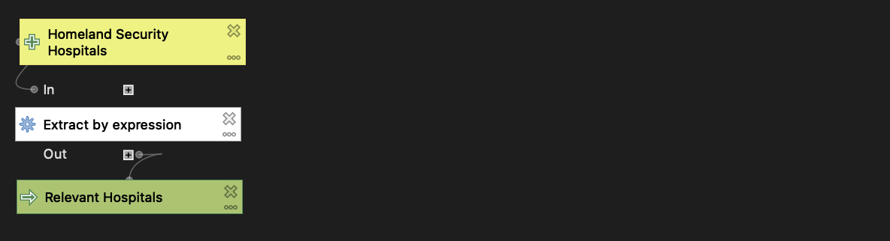
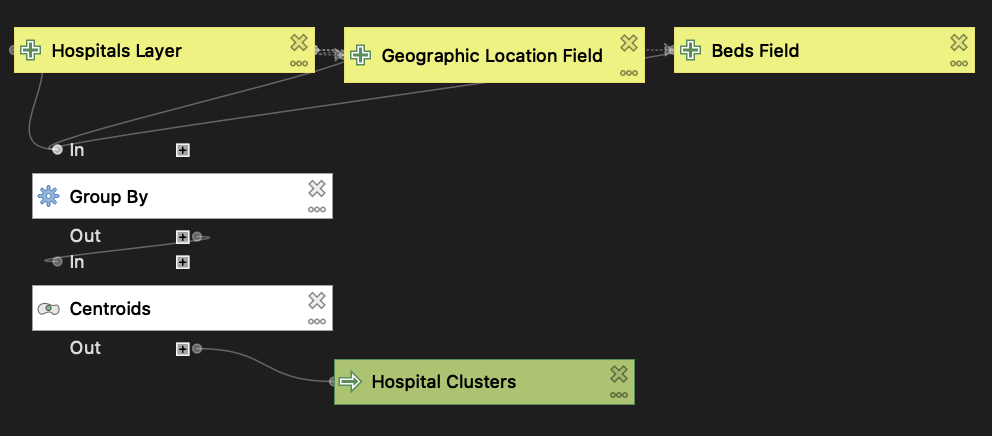
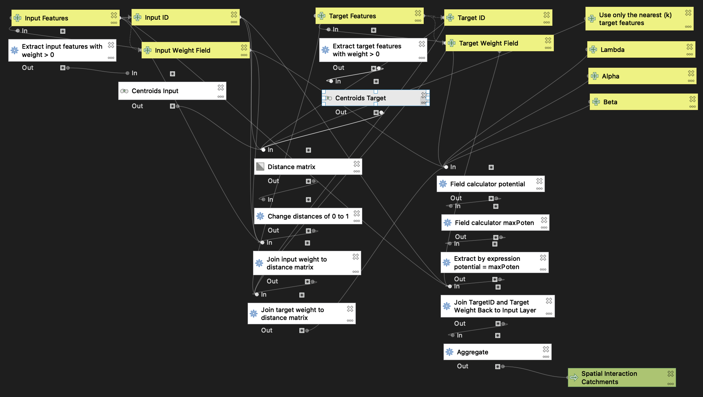

# Gravity Model of Spatial Interaction

[reflection2](../reflections/reflection2.md)

This week we created a QGIS model to execute a workflow for the [gravity model of spatial interaction](https://gis4dev.github.io/lessons/02a_gravitymodel.html), which predicts the amount of interaction between two places based on their attractiveness and distance apart, using the following formula:

Potential Interaction = (inputWeight)^λ * (targetWeight)^α / (distance)^β.

We tailored our model specifically for the purposes of creating hospital catchment areas, which encompass the towns we expect hospitals to serve based on the population of each town and the number of beds in each hospital.

In order to properly run the [main model](models/gravity_model.model3), a bit of preprocessing is necessary. We have to include only hospitals that have an intensive care unit (ICU) and are open to the public, so we exclude facilities such as military hospitals, psychiatric hospitals, and ["critical access hospitals"](https://www.ruralhealthinfo.org/topics/critical-access-hospitals), which are essentially small rural hospitals that likely lack an ICU. We also need to include only hospitals that have data on the number of beds (which is essential for modeling potential interaction), and of course we must exclude hospitals that are closed. I wrote [a model](models/preprocess_homelandSecurityHospitals.model3) to automate these steps for the U.S. Department of Homeland Security [hospitals layer](https://hifld-geoplatform.opendata.arcgis.com/datasets/6ac5e325468c4cb9b905f1728d6fbf0f_0), which includes hospitals for the entire nation. Finally, in order to accurately calculate catchment areas we should combine hospitals within the same geographic enumeration unit (zip code, town, etc.) to create "hospital clusters", a process that I automated with [this model](models/groupHosps_byGeographicLocation.model3). Note that the `Group By` tool used in this model comes from the [MiMiGIS plugin](https://github.com/GIS4DEV/MiMiGIS), which I developed this past January and February with Prof. Holler.

Here are images of the models, as they appear in the QGIS Model Designer:

[Preprocess Homeland Security Hospital Data](models/preprocess_homelandSecurityHospitals.model3)

[Group Hospitals By Geographic Location](models/groupHosps_byGeographicLocation.model3)

[Gravity Model of Spatial Interaction](models/gravity_model.model3)

I put my gravity model to use by calculating hospital catchment areas for the Northeast U.S., using towns/cities as the input (origin) layer and hospital clusters by zip code, which I prepared using my preprocessing and hospital grouping models, as the target (destination) layer. I then made a map comparing the catchment areas I computed with the Dartmouth Atlas of Health Care [hospital service areas](https://atlasdata.dartmouth.edu/downloads/supplemental#boundaries) (HSAs). Check out the web map [here](assets/index.html)!

While in some cases my hospital catchment areas match up well with the Dartmouth HSAs (for instance, the Malone HSA in far northern New York State), by and large the two layers are quite different. I suspect this is due to a couple of different factors. First, the potential interaction formula includes variable exponents for input weight, target weight, and distance. In this analysis, I used λ = 1, α = 1, and β = 2. I likely could have achieved greater similarity between my analysis and the Dartmouth HSAs by adjusting the values of these variables. Second, in my analysis I excluded critical access hospitals, whereas the Dartmouth Atlas includes at least some, if not all, hospitals with this designation. As a result, some of my hospital catchment areas encompass multiple Dartmouth HSAs (see, for example, my enormous catchment area stretching from northeastern New York State across northern Vermont). I predict that including critical access hospitals in my analysis would significantly decrease the disparities between my hospital catchment areas and the Dartmouth HSAs.

Data Sources:
 * Population by town for Northeastern US compiled by Joseph Holler using [TidyCensus](https://walker-data.com/tidycensus/) in R from 2018 American Community Survey 5-year estimates: [netown.gpkg](https://gis4dev.github.io/lessons/assets/netown.gpkg)
 * US hospital data from the Department of Homeland Security: https://hifld-geoplatform.opendata.arcgis.com/datasets/6ac5e325468c4cb9b905f1728d6fbf0f_0
 * Hospital service areas layer from the Dartmouth Atlas of Health Care: https://atlasdata.dartmouth.edu/downloads/supplemental#boundaries
