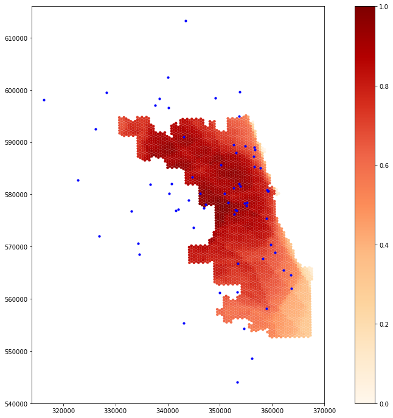

# Spatial accessibility of COVID-19 healthcare resources

## Reproduction of: Rapidly measuring spatial accessibility of COVID-19 healthcare resources: a study of Illinois, USA

Original study *by* Kang, J.-Y., Michels, A., Lyu, F., Wang, S., Agbodo, N., Freeman, V. L., & Wang, S. (2020). Rapidly measuring spatial accessibility of COVID-19 healthcare resources: A case study of Illinois, USA. International Journal of Health Geographics, 19. https://doi.org/10.1186/s12942-020-00229-x.

Reproduction Author:
Maja Cannavo, with invaluable help and code from Prof. Joseph Holler and the Spring 2021 [GEOG 323 class](https://gis4dev.github.io/)

Reproduction Materials Available at: [majacannavo/RP-Kang](https://github.com/majacannavo/RP-Kang)

Created: `25 May 2021`
Revised: `26 May 2021`

## Introduction

This study attempts to replicate the work of Kang et al. ([2020](https://doi.org/10.1186/s12942-020-00229-x)) on determining the spatial accessibility of COVID-19 healthcare resources in Chicago, Illinois. As the COVID-19 pandemic continues and the possibility of future such widespread health disasters remains acute, studying people's ability to access healthcare resources such as hospitals, and in particular critical resources such as ICU beds and ventilators, is crucial for ensuring an adequate and efficient healthcare infrastructure. Given that Kang et al.'s study was published only less than a year into the COVID-19 pandemic, reproduction is especially important as we continue to understand more and more about COVID-19, how it spreads, and how we can best provision healthcare resources to curb the pandemic and avoid losing lives. We can also continue to refine methods for how to calculate hospital catchment areas in a way that most closely approximates real-life patterns of hospital accessibility and use.

Kang et al. used an enhanced two-step floating catchment area method to establish service areas for hospitals in and near Chicago with three different travel-time thresholds, calculated ICU-bed-to-population ratios for each hospital, and summed the weighted ICU-bed-to-population ratios in locations served by multiple hospitals. The result is a choropleth map representing hospital accessibility across Chicago. Low levels of accessibility indicate a need for provision of additional healthcare resources.

## Materials and Methods

Kang et al. conducted their study using a Jupyter Python notebook running on the University of Illinois at Urbana-Champaign's [cyberGIS server](https://cybergis.illinois.edu/), which utilizes parallel computing to efficiently perform computationally intensive operations with very large amounts of data. They employed a number of Python libraries for geospatial analysis and data science, including [pandas](https://pandas.pydata.org/), [NumPy](https://numpy.org/), [GeoPandas](https://geopandas.org/), [NetworkX](https://networkx.org/), [OSMnx](https://osmnx.readthedocs.io/en/stable/), [Shapely](https://pypi.org/project/Shapely/), and [Matplotlib](https://matplotlib.org/). They used [US Census](https://www.census.gov/) data for population and demographic information, and [OpenStreetMap](https://www.openstreetmap.org/) data (downloaded in Python through OSMnx) for road network data. Hospitals were downloaded from the [US Department of Homeland Security](https://hifld-geoplatform.opendata.arcgis.com/datasets/geoplatform::hospitals/about).

I made two significant changes to the original Python notebook. Under Prof. Holler's suggestion, I (and the rest of the class) added a buffer distance when downloading the road network with OSMnx, in order to extend far enough outside of Chicago to reach all the hospitals used in the study (which were selected using a 15-mile buffer around the city boundary). I selected a buffer distance of 30 km, or about 18.6 miles, to ensure that all hospitals would be fully surrounded by the road network. The second change I made was to use a projected coordinate reference system (CRS), specifically NAD 83 / Illinois East (EPSG:26971), for the results map, in order to ensure a better looking map than the original, which used WGS 84 (EPSG:4326), an unprojected CRS. This involved modifying how hospitals are mapped (from x/y coordinates to projected geometries), projecting both the hospitals and the catchment areas into EPSG:26971, and setting boundaries on the x- and y-axes of the plot to ensure the map displayed the desired spatial extent.

## Results and Discussion

*Figure 1. Geographic Distribution of ICU Bed Accessibility in Chicago: Reproduction.*
   

*Figure 2. Geographic Distribution of ICU Bed Accessibility in Chicago: Original Results (Kang et al.).*
   

The results of the reproduction are fairly similar to Kang et al.'s results, with high ICU bed accessibility in north-central Chicago and lower accessibility in the southeastern part of the city. The extended street network is likely responsible for this difference in accessibility. It is somewhat surprising that the reproduction suggests increased accessibility along the western and northern edges of the city, however, since the extended street network actually prevents hospitals outside Chicago proper from snapping to an OSM node on the edge of the city and therefore places them farther away from Chicago residents. Perhaps these increased levels of accessibility are due to the road network now being fully connected around the edges of the city, without streets simply ending where the city boundary lies. Because it uses a projected and localized coordinate system, the reproduction map also portrays the shape of Chicago more accurately than the map from the original study, allowing viewers to more easily understand patterns of healthcare accessibility throughout the city.

Reading Kang et al.'s paper and completing the reproduction brought to light various insights and sources of uncertainty that were not documented in the paper. One of the main sources of uncertainty was using a street network that did not extend outside Chicago and then snapping hospital points to that street network even when they were located outside the city limits, effectively altering the locations of hospitals on the map. Another source of uncertainty in terms of reading and interpreting the map was the use of an unprojected CRS (WGS 84, EPSG:4326) instead of a localized, projected CRS. Overlap between different hospital catchment areas could have been calculated using area-weighted reaggregation to determine the amount of weight a given catchment area should add to any given hexagon based on how much the catchment area overlapped the hexagon; this could have improved accuracy.

The choice of a hexagonal grid was also not discussed, but the use of a different type of grid could have led to different results due to the modifiable areal unit problem, in which the choice of a particular geographic unit influences the results of a study. Metadata is missing from the original study about how the "overfifty" (population over 50 years old) field was calculated; obtaining Census data directly from the US Census API within the script or at least including metadata in the repository could clarify how these numbers were obtained. Including steps for filtering Homeland Security hospital data by type and location within the code could also enable future researchers to perform the analysis with updated hospital data. Finally, Kang et al.'s paper lacks a discussion of how important and efficient the network simplification is. A different method and/or level of simplification could change the results, indicating a source of uncertainty in terms of how the authors' modifications may have impacted service area computation.

Reading through Kang et al.'s code to understand how it worked also underscored for me the importance of well-named variables, adequate whitespace, and descriptive comments. Overall, the authors did a good job with this, organizing their code into small blocks with explanations and docstrings in between. However, there were instances, such as in the function definition for overlap_calc(), where the code was difficult to interpret. In this function, the name "intersect" is used so many times that it becomes unclear what it actually stands for. While the authors' code was generally quite understandable for someone with a solid knowledge of Python and geospatial analysis, exploring the authors' Jupyter notebook still reminded me of the importance of always writing for an audience, even when writing code.

## Conclusions

Overall, Kang et al.'s study of healthcare accessibility proved highly reproducible. The innovation of including almost the entire methodology in a Python Jupyter notebook housed within a GitHub repository made the authors' methods highly accessible and comprehensible. Although it is impossible to avoid uncertainty completely, having access to the authors' exact code significantly increased our level of understanding regarding the authors' workflow. Accessing the code also made it possible to make small tweaks with the aim of improving the accuracy of the analysis, such as extending the road network and projecting the map. Performing this reproduction enhanced my belief in the validity of the original study to a certain degree; this was a unique opportunity to read about the authors' results and then explore the minutiae of how they obtained them. The original study's limitation of the street network to Chicago proper is somewhat concerning, but the overall patterns observed by Kang et al. still appear generally valid even after adjusting the road network.

Further research should continue to investigate how altering the extent of the road network affects results. I was surprised to find that the inclusion of a more extensive road network actually increased accessibility on the outer edge of Chicago, but perhaps there are logical reasons for this, such as increased connectivity of streets around the city's edges. By using road networks of different buffer distances around the city, it can be further explored how patterns of accessibility relate to street network size and structure. Experimenting with different modes and levels of network simplification would enhance such a study. Finally, inclusion of other types of networks, such as public transportation, could improve modeling of how people actually travel, especially in an urban environment where many do not own cars. Other areas of further study could include the use of different catchment area modeling techniques, experimentation with different weights for catchment areas, and experimentation with different areal units as alternatives to the authors' hexagon grid.

## References

Boeing, G. 2017. OSMnx: New Methods for Acquiring, Constructing, Analyzing, and Visualizing Complex Street Networks. Computers, Environment and Urban Systems 65, 126-139. doi:10.1016/j.compenvurbsys.2017.05.004

Kang, J.-Y., Michels, A., Lyu, F., Wang, S., Agbodo, N., Freeman, V. L., & Wang, S. (2020). Rapidly measuring spatial accessibility of COVID-19 healthcare resources: A case study of Illinois, USA. International Journal of Health Geographics, 19. https://doi.org/10.1186/s12942-020-00229-x

####  Report Template References & License

This template was developed by Peter Kedron and Joseph Holler with funding support from HEGS-2049837. This template is an adaptation of the ReScience Article Template Developed by N.P Rougier, released under a GPL version 3 license and available here: https://github.com/ReScience/template. Copyright © Nicolas Rougier and coauthors. It also draws inspiration from the pre-registration protocol of the Open Science Framework and the replication studies of Camerer et al. (2016, 2018). See https://osf.io/pfdyw/ and https://osf.io/bzm54/

Camerer, C. F., A. Dreber, E. Forsell, T.-H. Ho, J. Huber, M. Johannesson, M. Kirchler, J. Almenberg, A. Altmejd, T. Chan, E. Heikensten, F. Holzmeister, T. Imai, S. Isaksson, G. Nave, T. Pfeiffer, M. Razen, and H. Wu. 2016. Evaluating replicability of laboratory experiments in economics. Science 351 (6280):1433–1436. https://www.sciencemag.org/lookup/doi/10.1126/science.aaf0918.

Camerer, C. F., A. Dreber, F. Holzmeister, T.-H. Ho, J. Huber, M. Johannesson, M. Kirchler, G. Nave, B. A. Nosek, T. Pfeiffer, A. Altmejd, N. Buttrick, T. Chan, Y. Chen, E. Forsell, A. Gampa, E. Heikensten, L. Hummer, T. Imai, S. Isaksson, D. Manfredi, J. Rose, E.-J. Wagenmakers, and H. Wu. 2018. Evaluating the replicability of social science experiments in Nature and Science between 2010 and 2015. Nature Human Behaviour 2 (9):637–644. http://www.nature.com/articles/s41562-018-0399-z.
