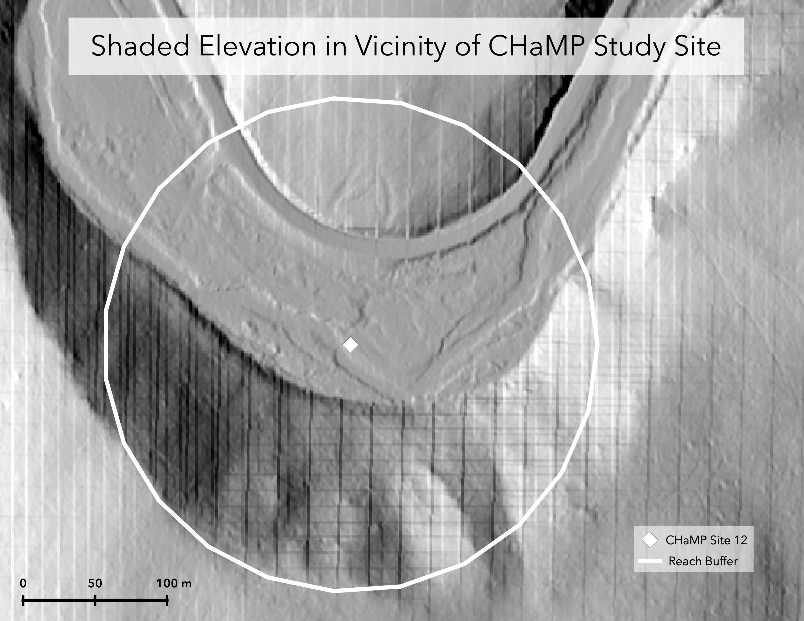
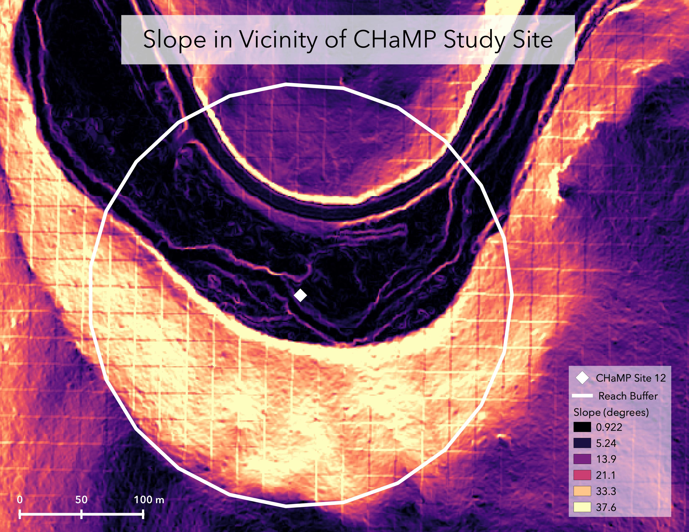
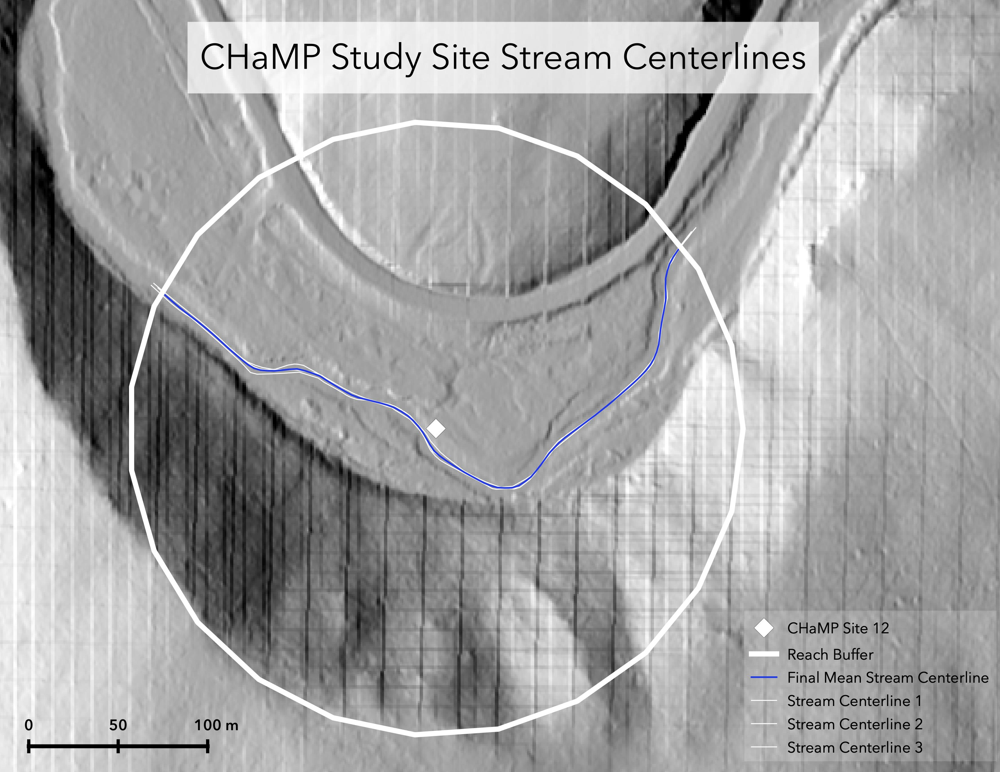
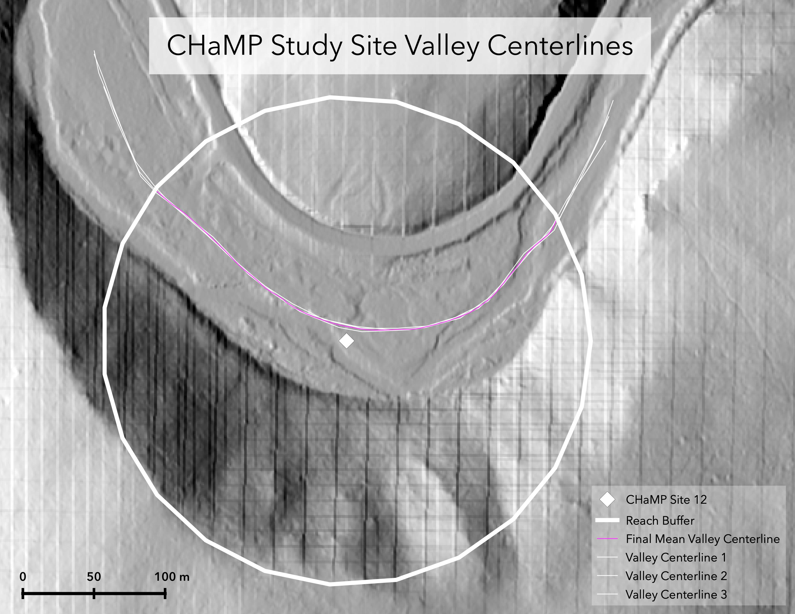
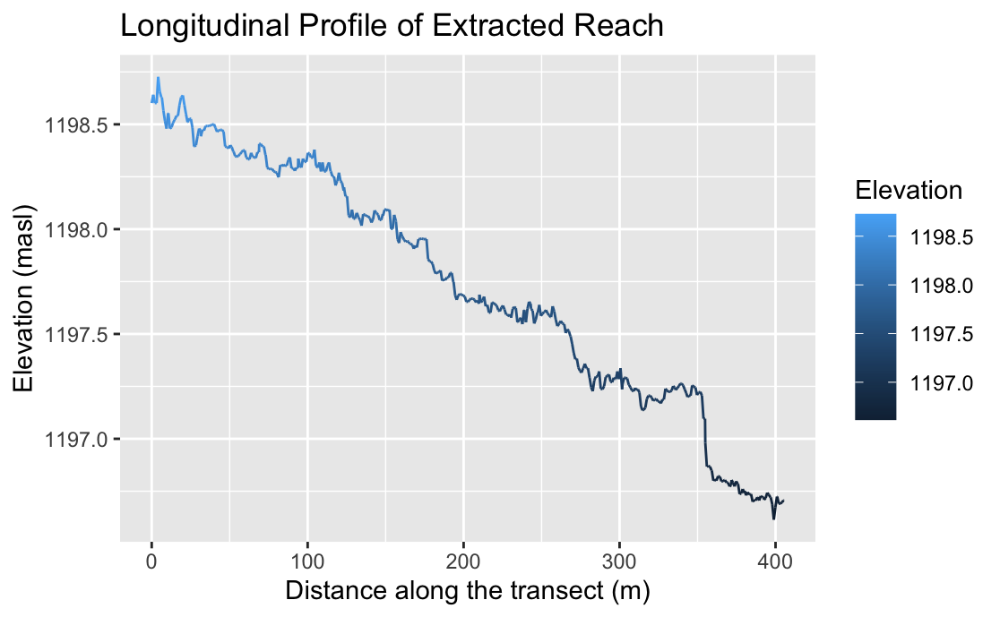
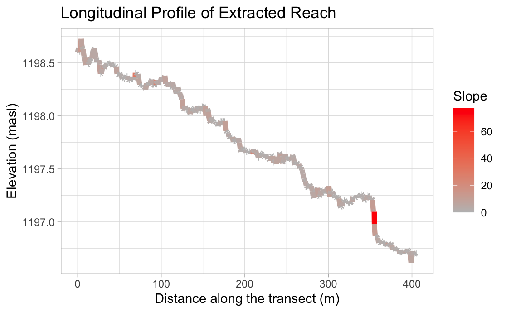
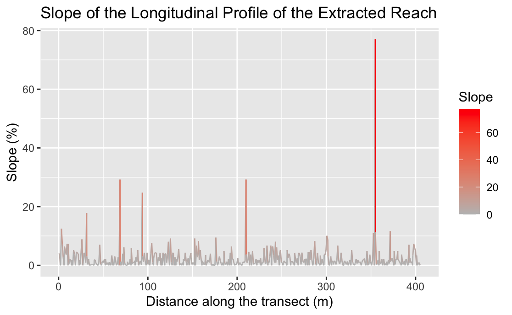
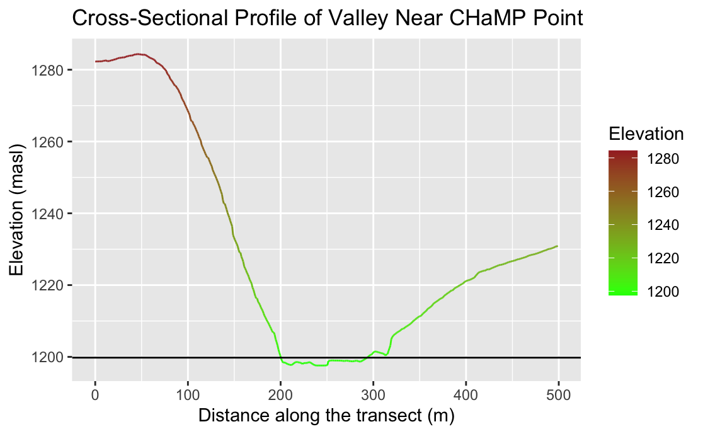
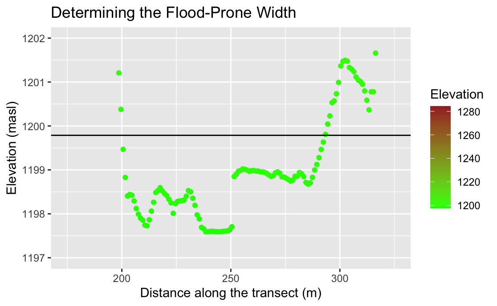

# Rosgen Classification in GRASS/R

## Replication of: A classification of natural rivers

Original study *by* Rosgen, D. L.
*in* *CATENA* 22 (3):169–199. https://linkinghub.elsevier.com/retrieve/pii/0341816294900019.

and Replication by: Kasprak, A., N. Hough-Snee, T. Beechie, N. Bouwes, G. Brierley, R. Camp, K. Fryirs, H. Imaki, M. Jensen, G. O’Brien, D. Rosgen, and J. Wheaton. 2016. The Blurred Line between Form and Process: A Comparison of Stream Channel Classification Frameworks ed. J. A. Jones. *PLOS ONE* 11 (3):e0150293. https://dx.plos.org/10.1371/journal.pone.0150293.

Replication Authors:
Maja Cannavo, Zach Hilgendorf, Joseph Holler, and Peter Kedron.

Replication Materials Available on GitHub at: [majacannavo/RE-rosgen](https://github.com/majacannavo/RE-rosgen).

Created: `23 March 2021`
Revised: `24 March 2021`

## Introduction/Motivation

In [this analysis](https://gis4dev.github.io/lessons/04b_rosgen_GRASS_R.html) we replicated the work of Rosgen ([1994](https://www.sciencedirect.com/science/article/pii/0341816294900019?via%3Dihub)) and Kasprak et al. ([2016](https://dx.plos.org/10.1371/journal.pone.0150293)) to classify river channels in the Middle Fork John Day River in Oregon, USA. Kasprak et al. implemented the Rosgen Classification System (RCS) [detailed in Rosgen, 1994] in addition to the River Styles Framework, Natural Channel Classification, and "a channel form-based statistical classification" to classify 33 sites in the Middle Fork John Day Basin and compare the results (Kasprak et al., 2016, p. 1). Kasprak et al. ultimately found that the various classification systems placed stream channels into similar groupings; disagreement among the frameworks tended to occur "in locations where valley setting was not a reliable predictor of channel form" (Kasprak et al., 2016, p. 27). We sought to replicate Kasprak et al.'s RCS analysis using open-source software, namely [GRASS GIS](https://grass.osgeo.org/) and [R](https://www.r-project.org/). A main goal of our replication was to determine the extent to which such a study is possible using just GIS analysis, without collecting any new data in the field.

## Methods

We were each randomly assigned a single location in the Middle Fork John Day River and employed the RCS to classify the stream channel at our location. My location was the site with loc_id = 12, as identified in the Columbia Habitat and Monitoring Program (CHaMP) [dataset](https://github.com/majacannavo/RE-rosgen/tree/main/data/raw/public). We started with 1-meter resolution LiDAR elevation data and the CHaMP dataset and ran our analysis in GRASS as detailed in this [research protocol](https://github.com/majacannavo/RE-rosgen/blob/main/procedure/protocols/1-Research_Protocol_GRASS.pdf) prepared by Zach Hilgendorf and Joseph Holler. Steps 3-10 on pages 8-9 of the research protocol were automated with [this GRASS model](https://github.com/majacannavo/RE-rosgen/blob/main/procedure/code/visualize.gxm), and steps 1-8 on pages 16-17 of the protocol were automated with [this GRASS model](https://github.com/majacannavo/RE-rosgen/blob/main/procedure/code/center_line_length.gxm). (Both models were written by Joseph Holler.) Kasprak et al. also used the CHaMP dataset but employed 10-meter and 0.1-m resolution digital elevation models (DEMs), as well as 1-m resolution aerial imagery and on-the-ground data collection, in their analysis (Kasprak et al., 2016, p. 9), so our data differs somewhat from theirs.

Following our GRASS analysis, we moved into RStudio to make graphs and further analyze the data we produced in GRASS, following this [R Markdown document](https://github.com/majacannavo/RE-rosgen/blob/main/procedure/code/2-ProfileViewer.Rmd). Using the results of our R and GRASS analyses in addition to the CHaMP dataset, we produced a table of site measurements, which enabled us to perform Level I and II Rosgen classifications (see Results and Discussion section). One deviation I made from the R Markdown document was to recalculate channel slope myself as (change in distance)/(change in elevation), based on the beginning and ending elevations from the [longitudinal profile](https://github.com/majacannavo/RE-rosgen/blob/main/data/derived/public/longprof.txt) I generated in GRASS.

## Results and Discussion

My results are summarized in the following figures and tables. (The maps were made in QGIS using data exported from GRASS.) Based on the CHaMP data and the values I calculated in GRASS and R, I classified my stream channel as type C4. I followed the Rosgen classification key on p. 3 of the [classification protocols handout](https://github.com/majacannavo/RE-rosgen/blob/main/procedure/protocols/3-Classifying.pdf). For Level I of the classification (see Table 2), I first examined the entrenchment ratio, which, at 5.475, is greater than 2.2, placing it in the "slightly entrenched" category. Then I considered the width-to-depth ratio, which came out to be 38.44, which is considered "moderate to high." Finally I looked at the sinuosity, which I calculated as 1.17. This measurement is almost 1.2, so I felt comfortable placing my stream channel in the "moderate to high sinuosity" category, which brought me to type C. For Level II of the classification (see Table 3), I next examined slope, which, at 0.00467, puts my channel in the middle slope range for type-C streams. My last step was to determine the channel material, which I deduced to be gravel based on the median channel material particle diameter of 61 mm, using the chart on p. 4 of the classification protocols handout. This led me to stream type C4.

The characteristics of my stream channel generally line up well with the expectations of the Rosgen framework, with the exception of sinuosity not quite falling into either expected category for slightly entrenched channels. However, according to the CHaMP data the sinuosity is 1.37, so perhaps my value, which I calculated as (stream length)/(valley length), is not quite accurate. It would not surprise me if the measurements obtained through my GRASS analysis were less rigorous than the ground-truthed values in the CHaMP data.

Kasprak et al. classified this location (CHaMP site ID CBW05583-290034) as stream type B3c (Kasprak et al., 2016, p. 18). While this classification is in an entirely different category from the one I found, types B3c and C4 are not too far apart in terms of their characteristics. Both have a moderate to high width/depth ratio and moderate or moderate-to-high sinuosity, as well as a slope ratio of less than 0.02. Kasprak et al.'s entrenchment ratio calculation must have differed from mine, since B-type streams are moderately entrenched, with a ratio of 1.4 - 2.2, while I found the entrenchment ratio to be 5.475. This must have resulted from different valley width and/or bankfull width measurements, since the entrenchment ratio is calculated as (valley width)/(bankfull width). Kasprak et al. also selected cobble as the channel material, while I selected gravel. Cobble was not given as an option on the size-to-material conversion chart on p. 4 of the classification protocols handout, but perhaps it if were, my particle diameter would have corresponded to cobble and I would have ended up with stream type C3 instead of C4.     

Figure 1.     

Figure 2.     

Figure 3.     

Figure 4.     

Figure 5.     

Figure 6.     

Figure 7.     

Figure 8. The black horizontal line, which also appears in Figure 9, represents the width of the valley's flood-prone area. We place the line at a height of twice the maximum bankfull depth.      

Figure 9.     

Table 1. Site Measurements

| Variable | Value | Source |
| :-: | :-: | :-: |
| Mean Bankfull Width (m) | 17.17 | CHaMP |
| Mean Bankfull Depth (m) | 0.4466 | CHaMP |
| Max Bankfull Depth (m) | 1.098 | CHaMP |
| Valley Width (m) | 94 | Cross-sectional profile in R |
| Valley Depth (m) | 2.197 | 2 x max bankfull depth |
| Stream/River Length (m) | 406.3 | GRASS centerline attribute table |
| Valley Length (m) | 347.8 | GRASS centerline attribute table |
| Median Channel Material Particle Diameter (mm) | 61 | CHaMP |

  

Table 2. Rosgen Level I Classification

| Criterion | Value |
| :-: | :-: |
| Entrenchment Ratio | 5.475 |
| Width / Depth Ratio | 38.44 |
| Sinuosity | 1.17 |
| Level I Stream Type | C |

  

Table 3. Rosgen Level II Classification

| Criterion | Value |
| :-: | :-: |
| Slope (ratio) | 0.00467 |
| Channel Material | Gravel |
| Level II Stream Type | C4 |

 

## Conclusion

This replication demonstrates that it is indeed feasible to perform Rosgen stream classification using open-source GIS software and achieve a reasonable degree of accuracy. However, using even partially different datasets in addition to different software (instead of GRASS, Kasprak et al. used the [River Bathymetry Toolkit](https://essa.com/explore-essa/tools/river-bathymetry-toolkit-rbt/) with ArcGIS [Kasprak et al., 2016, p. 9]) can have a significant impact on results. My stream channel ended up in entirely different Level I and II classifications from Kasprak et al.'s, despite also using the RCS, which suggests differences in the underlying data and values used to inform these classifications. Moreover, although the RCS is ostensibly an objective and quantitative classification scheme, it does leave room for subjectivity, especially when a stream channel defies expected behavior.

Ultimately, this replication suggests that open-source GIS is a robust and capable tool for performing analyses that would normally rely on field-collected, ground-truthed data. However, disparities in underlying datasources and analytical tools, along with the inherent subjectivity involved in part-quantitative, part-qualitative analyses, make achieving identical results a challenge. Future research should continue to explore the possibilities for students to replicate various types of hydrologic and terrain analyses using open-source software. The results may not exactly match those of the original research. Nevertheless, the replication process and its outcomes have much to teach both students and researchers not only about the phenomena they are investigating, but also about how specific choices of datasources and software impact the accuracy, precision, and reproducibility of their results.

## References

Kasprak, A., Hough-Snee, N., Beechie, T., Bouwes, N., Brierley, G., Camp, R., Fryirs, K., Imaki, H., Jensen, M., O’Brien, G., Rosgen, D., & Wheaton, J. (2016). The Blurred Line between Form and Process: A Comparison of Stream Channel Classification Frameworks. PLOS ONE, 11(3), e0150293. https://doi.org/10.1371/journal.pone.0150293

Rosgen, D. L. (1994). A classification of natural rivers. CATENA, 22(3), 169–199. https://doi.org/10.1016/0341-8162(94)90001-9

####  Report Template References & License

This template was developed by Peter Kedron and Joseph Holler with funding support from HEGS-2049837. This template is an adaptation of the ReScience Article Template Developed by N.P Rougier, released under a GPL version 3 license and available here: https://github.com/ReScience/template. Copyright © Nicolas Rougier and coauthors. It also draws inspiration from the pre-registration protocol of the Open Science Framework and the replication studies of Camerer et al. (2016, 2018). See https://osf.io/pfdyw/ and https://osf.io/bzm54/

Camerer, C. F., A. Dreber, E. Forsell, T.-H. Ho, J. Huber, M. Johannesson, M. Kirchler, J. Almenberg, A. Altmejd, T. Chan, E. Heikensten, F. Holzmeister, T. Imai, S. Isaksson, G. Nave, T. Pfeiffer, M. Razen, and H. Wu. 2016. Evaluating replicability of laboratory experiments in economics. Science 351 (6280):1433–1436. https://www.sciencemag.org/lookup/doi/10.1126/science.aaf0918.

Camerer, C. F., A. Dreber, F. Holzmeister, T.-H. Ho, J. Huber, M. Johannesson, M. Kirchler, G. Nave, B. A. Nosek, T. Pfeiffer, A. Altmejd, N. Buttrick, T. Chan, Y. Chen, E. Forsell, A. Gampa, E. Heikensten, L. Hummer, T. Imai, S. Isaksson, D. Manfredi, J. Rose, E.-J. Wagenmakers, and H. Wu. 2018. Evaluating the replicability of social science experiments in Nature and Science between 2010 and 2015. Nature Human Behaviour 2 (9):637–644. http://www.nature.com/articles/s41562-018-0399-z.
