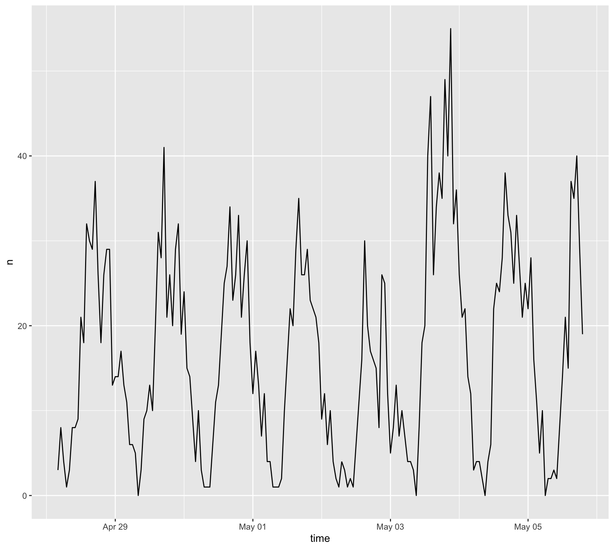
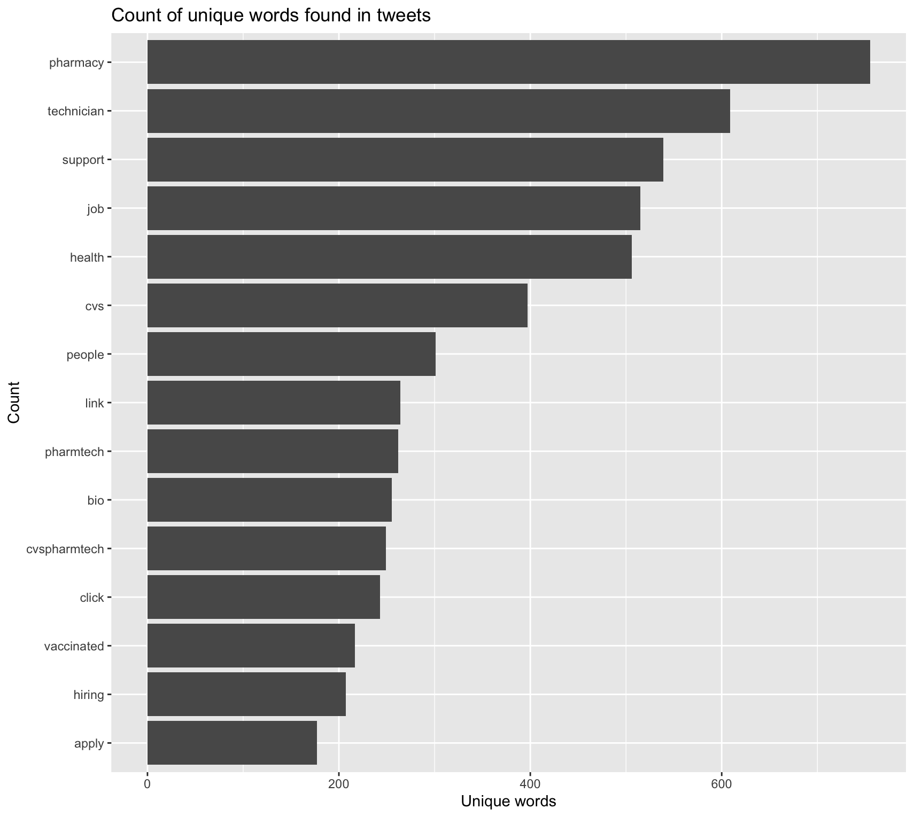
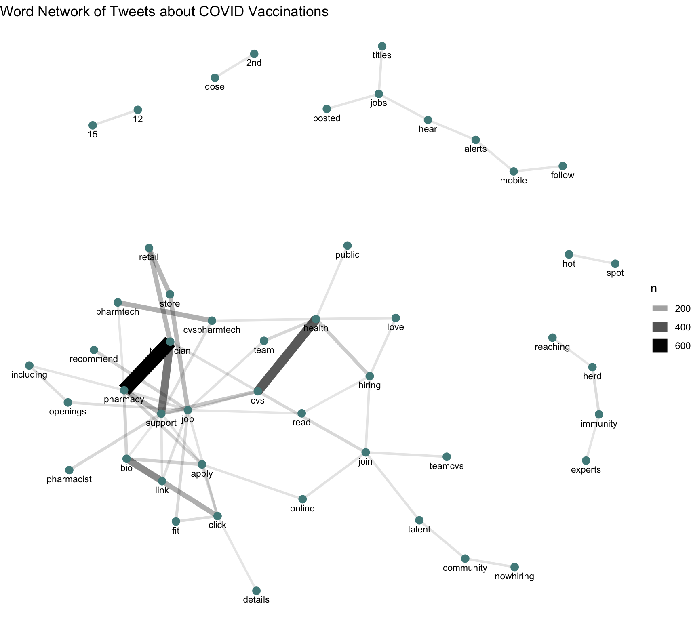
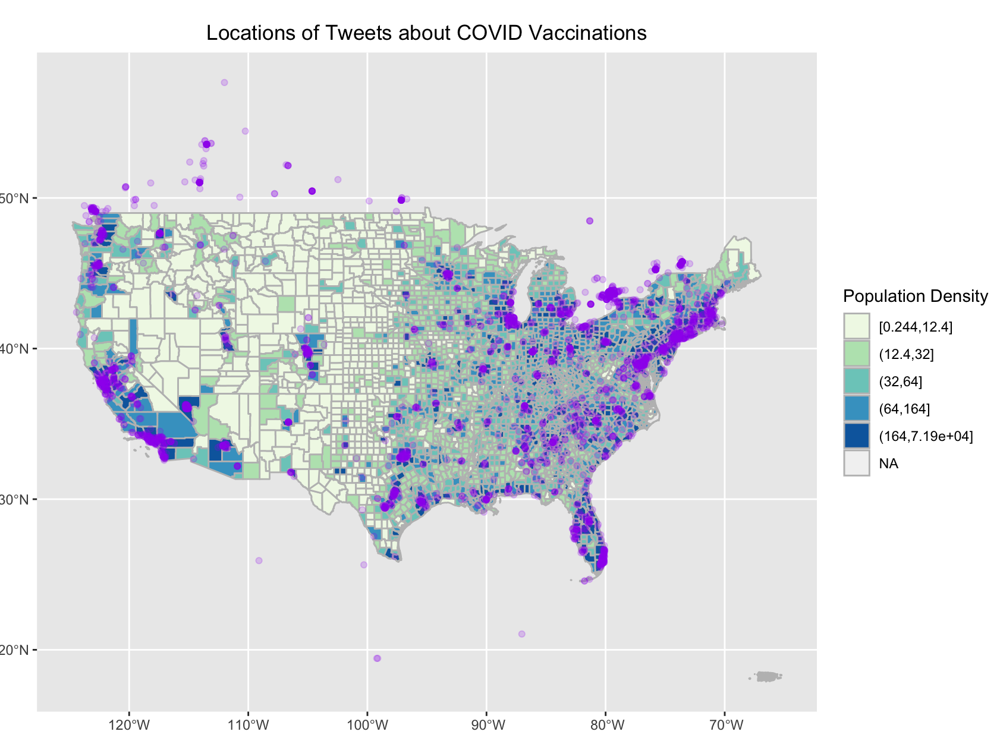
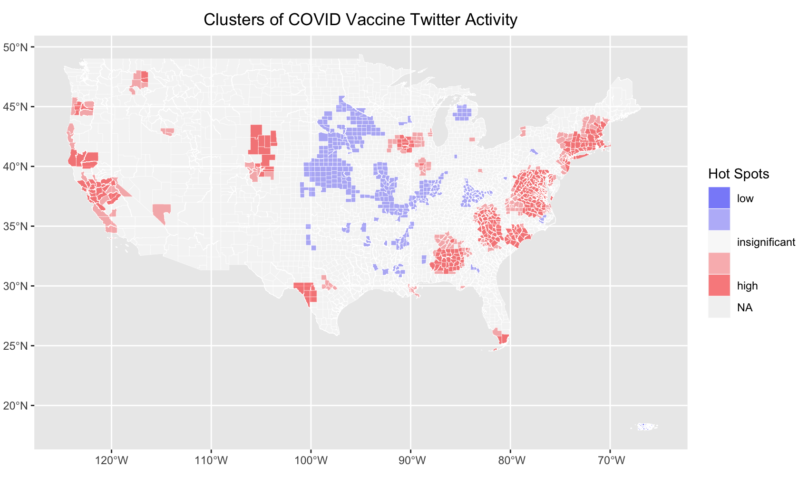

# Spatial Twitter Analysis

## Replication of: Spatial, temporal and content analysis of Twitter data

Original study *by* Wang, Z., X. Ye, and M. H. Tsou. 2016. Spatial, temporal, and content analysis of Twitter for wildfire hazards. *Natural Hazards* 83 (1):523–540. DOI:[10.1007/s11069-016-2329-6](https://doi.org/10.1007/s11069-016-2329-6).
and
First replication study by Holler, J. 2021 (in preparation). Hurricane Dorian vs Sharpie Pen: an empirical test of social amplification of risk on social media.

Replication Author:
Maja Cannavo

Replication Materials Available at: [majacannavo/RE-Dorian](https://github.com/majacannavo/RE-Dorian)

Created: `10 May 2021`
Revised: `11 May 2021`

## Abstract

Volunteered geographic information (VGI) such as Twitter data is a powerful tool for investigating conditions at locations--as we discussed in class, the fundamental building blocks of geospatial analysis. While Twitter data certainly have their limitations and issues for use in research (Crawford and Finn 2015), the spatial distribution of tweets on a particular subject can reveal important patterns of where, when, and how information on that subject is conveyed and propagated.

Wang et al. (2016) analyzed Twitter data for wildfires in California, finding that the social media data can provide valuable on-the-ground insight into disaster situations, that residents use social media as a key avenue for communicating geographic information and other messages and updates during wildfires, and, finally, that "news media and local authorities" play a key role in transmitting wildfire-related information, as their messages are frequently retweeted (p. 523).

Holler (2021) is studying Twitter data for Hurricane Dorian on the Atlantic coast, finding that in spite of trending news and social media content regarding a false narrative of risk, original tweets still clustered significantly along the real hurricane track, and only along the hurricane track.

Reproducing and replicating spatial research of patterns of VGI continues to be relevant because social media and other platforms for amassing VGI are becoming increasingly prominent avenues for both reporting and investigating conditions on the ground during natural disaster events, periods of political turmoil, the current COVID-19 pandemic, and much more. Because the stock of available Twitter data changes constantly as tweets are posted, retweeted, and deleted, and the Twitter Search API permits access to only very recent tweets, exact reproduction of spatial Twitter analyses is difficult. However, replication of such analyses with new data and in new study time periods and geographic regions can provide important insight into spatial patterns of how people experience all kinds of events and distribute information through the internet and social media. Furthermore, as Crawford and Finn (2015) argue, "[Twitter] is not a neutral platform for observing people in a natural communicative space, nor is it divorced from the lived experience of a crisis. Instead, it is a space which has its own specific correspondence to the unfolding of a material event" (pp. 495-6). Continued analysis of spatial patterns in Twitter data can shed light on the ways in which the very act of posting on social media distorts people's portrayal of an event or issue.

In this replication study, I will analyze spatial distribution of tweets about COVID-19 vaccinations from April 28, 2021 to May 5, 2021 across the United States.

## Original Study Information

Holler (2021) loosely replicated the methods of Wang et al. (2016) for the case of Hurricane Dorian's landfall on the U.S. mainland during the 2019 Atlantic Hurricane season. Wang et al.'s data were based on Twitter Search API queries for "fire" and "wildfire" and then more specific queries for wildfires in San Marcos and Bernardo, California (Wang et al. 2016, pp. 525-6). They analyzed the geographic distribution of the San Marcos and Bernardo tweets using kernel density estimation (KDE), examined the temporal distribution of these tweets, and constructed a "retweet network" of wildfire-related Twitter activity (Wang et al. 2016, pp. 526, 529). Wang et al. found that people demonstrated "geographical awareness during wildfire events" by referencing the geographic locations of wildfires in their tweets, and that they used Twitter as a platform to convey updates about the unfolding disasters (pp. 535-6). Analysis of the retweet network demonstrated the presence of "hubs" such as news media outlets and government agencies, to whom people look for reliable information during times of disaster (Wang et al. 2016, pp. 536-7).

Holler modified Wang et al.'s methods by not searching for retweets for network analysis, focusing instead on original tweet content with keywords "hurricane," "Dorian," or "sharpiegate" (a trending hashtag referring to the storm). Holler modified the methodology for normalizing tweet data by creating a normalized difference tweet index (NDTI) and extended the methodology to test for spatial cluserting with the local Getis-Ord statistic. The study tested a hypothesis that false narratives of hurricane risk promulgated at the highest levels of the United States government would significantly distort the geographic distribution of Twitter activity related to the hurricane and its impacts, finding that original Twitter data still clustered only in the affected areas of the Atlantic coast in spite of false narratives about risk of a westward track through Alabama.

Wang et al. (2016) conducted their study using the `tm` and `igraph` packages in `R 3.1.2`. Both the replication study by Holler (2021) and my own use `R`, including the `rtweet`, `rehydratoR`, `igraph`, `sf`, and `spdep` packages for analysis.

## Materials and Procedure

I conducted my Twitter API search on May 5, 2021, at a time when COVID-19 vaccine availability was rapidly expanding and vaccinations were a major topic of news and conversation. I searched for the combinations of "covid" and "vaccine," "covid" and "vaccines," and "covid" and "vaccinations." For my search radius, I used starting coordinates of (39° N, 99° W) with a 1500-mile radius. This yielded results for the entire continental US, Puerto Rico, and some areas of Canada and Mexico. (The Canadian and Mexican tweets were not included in the spatial cluster analysis.) For a "control" group of tweets with which to compute the NDTI, I searched for all tweets in the same geographic extent also on May 5, 2021. The vaccine-related tweet status_id's can be found [here](https://github.com/majacannavo/RE-Dorian/blob/main/data/vaccine/public/vaccineids.txt), and the control group can be found [here](https://github.com/majacannavo/RE-Dorian/blob/main/data/vaccine/public/mayids.txt). County population data for the entire US were used to normalize the tweet counts to rates of tweets per population. These population data were obtained from the [US Census Bureau](https://www.census.gov/) via [tidycensus](https://walker-data.com/tidycensus/) in R.

My analysis methods followed Holler's nearly exactly. First, I converted the GPS coordinates of the tweets (both vaccine and control) into latitude and longitude data and selected for tweets with latitude and longitude data or tweets tagged with a particular city, neighborhood, or point-of-interest location (Fig. 1). I graphed the temporal distribution of the vaccine tweets. Then I calculated the frequencies of words appearing in the vaccine tweets in order to analyze which words were most common (Fig. 2). I also made a network graph of commonly appearing word pairs (Fig. 3).

Next I used a spatial join to join both vaccine and control tweets to counties. I then calculated the vaccine tweet rate per 1000 people by county. Finally, to analyze spatial clustering of hot spots and cold spots for vaccine-related tweets, I used [Casey Lilley](https://caseylilley.github.io/)'s (2019) methodology, edited by Holler (2021), to apply Getis and Ord's (1995) G*-statistic, which measures spatial autocorrelation based on a nearest-neighbor analysis. The results of this analysis appear in Fig. 5, which shows counties home to statistically significant hot and cold spots for vaccine tweet activity.

## Replication Results

*Figure 1. Number of COVID-vaccine-related tweets over the course of the study period.*
   

*Figure 2. Most common words found in the vaccine-related tweets, by frequency of appearance.*
   

*Figure 3. Network of word pairs commonly colocated in vaccine-related tweets.*
   

*Figure 4. Locations of vaccine-related tweets in the continental US.*
   

*Figure 5. Hot spots and cold spots for vaccine-related Twitter activity in the continental US.*
  

## Unplanned Deviations from the Protocol

No significant unplanned deviations from the protocol proved necessary in this analysis. A slight methodological difference between my Dorian practice analysis and my vaccine analysis is that I spatially joined tweets to counties using PostGIS in the Dorian analysis, while I performed the same task in R for the vaccine analysis. The spatial clustering analysis using the G*-statistic was also not a part of my original Dorian workflow because we had not yet been given the code for it.

## Discussion

Vaccine-related Twitter activity followed a relatively stable daily pattern over the course of the study period (Fig. 1), with a discernable spike around May 4. Perhaps this is related to President Biden's [May 4 announcement](https://www.cnn.com/2021/05/04/politics/biden-covid-goals-july-4/index.html) of his administration's plans for the next phase of vaccination efforts and its goal to have administered at least one dose of the COVID-19 vaccine to 70% of the American adult population by July 4. Pfizer/BioNTech also announced on May 4 that it [expected to soon receive FDA authorization](https://www.cnn.com/2021/05/03/health/pfizer-covid-vaccine-teens-fda/index.html) to administer its vaccine to children from 12-15 years old, which the [FDA subsequently granted](https://www.npr.org/sections/coronavirus-live-updates/2021/05/10/993591902/hold-fda-oks-pfizer-covid-19-vaccine-for-12-15-age-group) on May 10. However, given that COVID-19 vaccination is an ongoing project, it is unsurprising that outside of the May 4 tweet spike, vaccine-related tweet volumes followed a relatively stable daily pattern over the course of the study period. While Wang et al. (2016) and Holler (2021) found spikes in relevant tweet volumes associated with the timing of the disasters they were studying, my analysis showed less of a temporal pattern because it did not focus on a distinct occurrence but rather a long-term issue. Also, my analysis did not display the "1-day time lag" reported by Wang et al. between event and tweet spike (p. 529), likely because information on new developments was available immediately over the internet and people did not overwhelm cell-phone or WiFi networks in any given location, which would have limited data transmission capabilities.

The set of most common words found in COVID-vaccine-related tweets reveals that much of the Twitter activity surrounding COVID vaccines was related to employment, using words like "technician," "job," "pharmtech," "cvspharmetch," "hiring," and "apply" (Fig. 2). The word association graph in Fig. 3 shows that "pharmacy" and "technician" were found together very frequently, likely in tweets advertising for pharmacy technicians to help with administering vaccines. Other common themes in these tweets include mentions of CVS, where many vaccines are being administered, and "pharmacy." Fig. 3 reveals more details about the contents of the tweets. The words "12" and "15" were often mentioned together, likely referencing the anticipated authorization of Pfizer's vaccine for children in the 12-15-year age group. The words "2nd" and "dose" often appeared together, probably from people tweeting about receiving their second dose of the vaccine. "Reaching," "herd," "immunity," and "experts" were also closely linked, showing that people were tweeting about experts' predictions for reaching herd immunity due to vaccinations.

Similar to Holler's (2021) findings, vaccine-related tweet locations corresponded closely to areas of high population density (Fig. 4), since there are simply more poeple in these places to post tweets. However, the cluster analysis results (Fig. 5) tell a different story. Clusters of vaccine-tweet hotspots could be found along various stretches of the West and East Coasts, as well as in areas of southwestern Texas and southern Florida, among other locations. Areas of low vaccine-related Twitter activity were largely found in the Midwest, with other singificant pockets in eastern Kentucky and northern Michigan (Fig. 5). Clearly, spatial patterns of vaccine-related Twitter activity do exist across the US. Given that so many of the vaccine-related tweets referenced pharmacies and employment, I would imagine that vaccine-tweet hotspots tended to be areas with high demand for vaccines, while cold spots generally experienced lower vaccine demand. The more people clamoring to be vaccinated, the greater the number of pharmacy technicians required to administer these vaccines. Such high-demand regions were also likely to be the ones where people most commonly tweeted happily about receiving their second dose and discussed the possibility of FDA authorization of the Pfizer vaccine for children from 12-15 as well as predictions about herd immunity emerging as a result of vaccinations.

## Conclusion

Overall, I found that COVID-vaccine-related tweets during the week leading up to May 5, 2021 experienced an explainable peak on May 4 but otherwise followed a relatively stable temporal pattern. Many of these tweets were related to hiring of pharmacy technicians for vaccination efforts; other common themes included granting vaccine authorization for 12-15-year-olds, expert predictions for reaching herd immunity, and second doses of the vaccine. High numbers of vaccine-related tweets tended to be found in areas of high population density, but more subtle patterns emerged during the cluster analysis, demonstrating significant regional variations in vaccine-related tweet rates when normalized by population.

These findings build on Wang et al.'s (2016) and Holler's (2021) spatial Twitter analyses by suggesting that spatial, temporal, and content analysis of Twitter data can provide insight into and information about a wide range of events and trends, not just spatially contained natural disasters like wildfires and hurricanes. Not only did my analysis reveal trends in what vaccine-related topics were most commonly discussed on Twitter; it also showed where unusually large numbers of these tweets were coming from. Thus, my analysis suggests that Twitter data can be employed to analyze not only spatial distribution of awareness of, and concern about, location-specific hazards, but also spatial distribution of opinion, and interest in, a variety of topics. While the results of my analysis generally confirm patterns observed by Wang et al. and Holler, small differences such as the lack of a daylong time lag in relevant tweets after a major event highlight the differences between how mentions of natural disasters manifest on Twitter and how discussions of broader trends and issues appear on the social network.

Future research should seek to further investigate the differences between spatial and temporal patterns of Twitter activity related to site-specific natural disasters and such patterns related to more universal issues. A continuation of my particular analysis could delve deeper into the reasons why hot spots and cold spots appeared where they did by investigating factors like political sentiment, vaccination rates, vaccine demand, and local COVID-related policies and legislation across the country. Such an analysis could also investigate how the content of vaccine-related tweets varied across the country and whether certain tweet content was correlated with hot or cold spots. Twitter data are a rich and powerful source of information on a wide variety of events, topics, and issues, and in this analysis I have merely scratched the surface of the insights such data can provide.

## References

Crawford, K., & Finn, M. (2015). The limits of crisis data: Analytical and ethical challenges of using social and mobile data to understand disasters. GeoJournal, 80(4), 491–502. https://doi.org/10.1007/s10708-014-9597-z

Holler, J. 2021 (in preparation). Hurricane Dorian vs Sharpie Pen: an empirical test of social amplification of risk on social media.

Ord, J. K., & Getis, A. (1995). Local Spatial Autocorrelation Statistics: Distributional Issues and an Application. Geographical Analysis, 27(4), 286–306. https://doi.org/10.1111/j.1538-4632.1995.tb00912.x

Wang, Z., X. Ye, and M. H. Tsou. 2016. Spatial, temporal, and content analysis of Twitter for wildfire hazards. *Natural Hazards* 83 (1):523–540. DOI:[10.1007/s11069-016-2329-6](https://doi.org/10.1007/s11069-016-2329-6).

####  Report Template References & License

This template was developed by Peter Kedron and Joseph Holler with funding support from HEGS-2049837. This template is an adaptation of the ReScience Article Template Developed by N.P Rougier, released under a GPL version 3 license and available here: https://github.com/ReScience/template. Copyright © Nicolas Rougier and coauthors. It also draws inspiration from the pre-registration protocol of the Open Science Framework and the replication studies of Camerer et al. (2016, 2018). See https://osf.io/pfdyw/ and https://osf.io/bzm54/

Camerer, C. F., A. Dreber, E. Forsell, T.-H. Ho, J. Huber, M. Johannesson, M. Kirchler, J. Almenberg, A. Altmejd, T. Chan, E. Heikensten, F. Holzmeister, T. Imai, S. Isaksson, G. Nave, T. Pfeiffer, M. Razen, and H. Wu. 2016. Evaluating replicability of laboratory experiments in economics. Science 351 (6280):1433–1436. https://www.sciencemag.org/lookup/doi/10.1126/science.aaf0918.

Camerer, C. F., A. Dreber, F. Holzmeister, T.-H. Ho, J. Huber, M. Johannesson, M. Kirchler, G. Nave, B. A. Nosek, T. Pfeiffer, A. Altmejd, N. Buttrick, T. Chan, Y. Chen, E. Forsell, A. Gampa, E. Heikensten, L. Hummer, T. Imai, S. Isaksson, D. Manfredi, J. Rose, E.-J. Wagenmakers, and H. Wu. 2018. Evaluating the replicability of social science experiments in Nature and Science between 2010 and 2015. Nature Human Behaviour 2 (9):637–644. http://www.nature.com/articles/s41562-018-0399-z.
